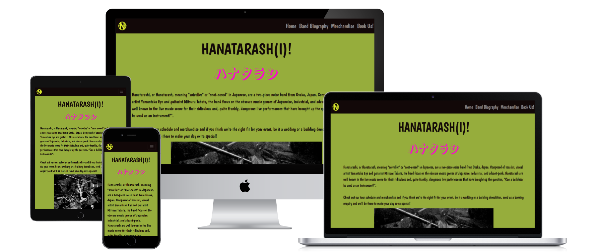
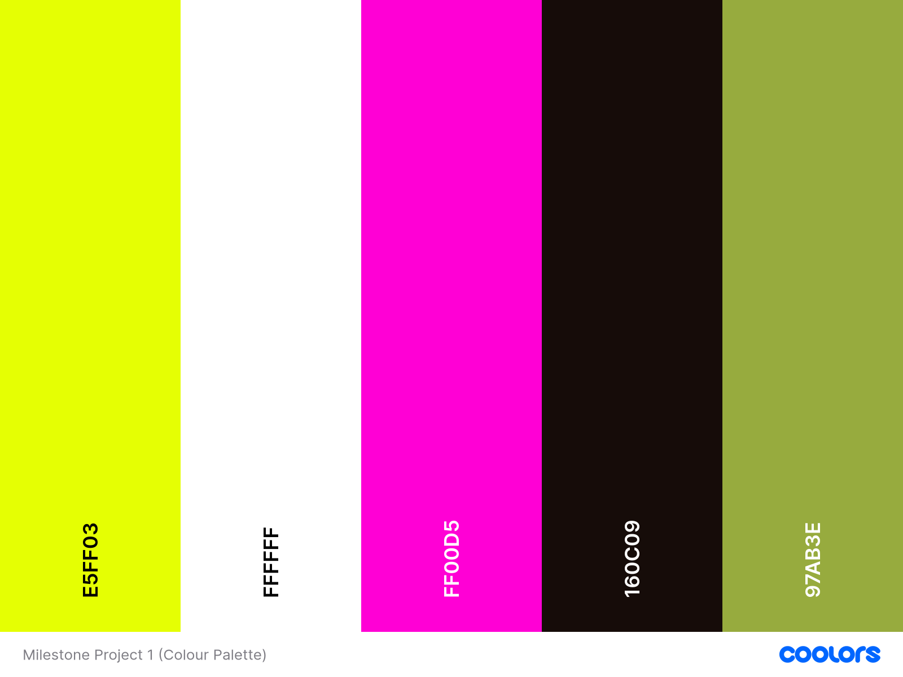

# Milestone Project 1- Website for the band, Hanatarash(i)

# Menu of contents
## 1. Deployment 
## 2. Purpose of project
## 3. User Stories
### 1. Must Haves
### 2. Should Haves
### 3. Could Haves
## 4. UX Design
## 5. UI Design
## 6. Testing
### 1. Coding Validation
### 2. Bugs found and resolved
## 7. Next Step Features
## 8. Coding Sources
## 9. Media sources
## 10. Acknowledgements

## 1. Deployment 
 Project was deployed using GitHub and Visual Studio.

### Live Site
https://tlc-1990.github.io/Milestone-1-Project/

(created using https://websitemockupgenerator.com/)

## 2. Purpose
To create a website to promote the band, Hanatarash(i), which showcases their music, videos, photos, merchandise, tour dates and availability for users to book them for events. 

## Criteria provided by Code Institute 
 
### External user’s goal: 
The site's users are fans and potential fans who wish to learn more about the band's history and the band members, and possibly book them for shows.

### Site owner's goal:
The band are interested in selling more of their music/merchandise and getting more gigs.

### Potential features to include:
Showcase photos, audio and/or video clips from the band's catalog.

Publicise the band's upcoming shows and/or availability to perform at events such as weddings and corporate parties.

Provide links to external resources, such as the band's social media profiles (can point anywhere at all).

## 3. User Stories
As a user, I want to see a range of photographs of the band and their releases so I can get a feel for who they are and their aesthetic. 

As a user, I want to be able to see when the band are touring so I can book tickets for their shows and send enquiries for my own events. 

As a user, I want to be able to directly contact the band for any equiries outside of booking them for events. I also want access to their social media links so I can follow them on different platforms. 

As a user, I want playable video/audio links which will give me an idea of the band's sound and genre. 

As a user, I want the website to be user-friendly and easy to navigate and return to home. This will keep me on the site for longer. 

As a user, I want to be able to view and learn about available merchandise and then buy it. 

As a user, I want a success message to show after I have sent my enquiry so that I know it has been sent successfully. 

As a user, I would like to see testimonials from other people who have booked the band so that I can make an informed decision about whether I would like to book them. 

### 1. Must-haves
* A range of high-quality press and live photos of the band and their releases
* A calendar of upcoming tour dates with links for users to buy tickets
* Contact details (address, phone, email and social media links)
* Booking enquiry form 
* Playable video/audio links 
* User friendly navigation

### 2. Should-haves
* Merchandise page with clear, navigable categories and external links for purchase
* Success message to indicate a booking enquiry has been recieved. 

### 3. Could-haves
* Testimonials from users who have previously booked the band

## 4. UX Design

### Strategy
The aim of the project is to promote the band by making users aware of their history, marketing their merchandise, creating awareness of thier upcoming gigs and allowing users to send booking enquiries for their own events. 

These elements will assist the band in securing more gigs and selling more merchandise and tickets. They are also for fans to access information about the band, buy merchandise and tickets as well as book them for personal events. 

### Scope
The project will include four linked pages:
1. Homepage - This will include a brief introduction, a carousel of images, band member information, a video and a calendar of upcoming gigs (with links to ticket sites)
2. Biography page - A more in-depth look into the band's history with more photographs. 
3. Merchandise page - This will include three navigable sections (Records/CDs, T-Shirts and Books). Each item will have an external link for 'purchase'. 
4. Booking Enquiry page - This page will include a form through which the user can send a booking enquiry to the band along with a message. 
The user will be asked for their title, first and last name, email and phone number. Sending a fully-filled form will lead the user to a success message, which will provide a link back to the homepage. 

Each page will include a footer with contact information (address, email and phone number) as well as social media links (as icons). 

The homepage, biography page and merchandise page will also include a button link to the enquiry page to book the band for events. 

### Structure
(See Wireframes section below)

### Skeleton

The user will navigate between the pages by clicking the links in the navbar menu (visible in tablet view and on desktop, collapsed on mobile devices).
The active page will be highlighted in the navbar. 

Clicking the select menu on the merchandise page (in tablet and desktop view) will take the user to the specific merchandise section. 

### Surface
To match the aesthetic and sound of the band, the website's colourscheme will match this contrast and  will contain 'Sushi' #96ad3c and 'Night Rider' #120808 background colours.

The smaller text of the site will be 'Night Rider' #120808 or Chartruse Yellow' #e5ff00 against the contrasting backgrounds to allow for readability. Large text highlights will be in 'Purple Pizzazz' #ff00d5
 
(https://coolors.co/ used to create palette)

#### Fonts 

## 5. UI Design
## Initital wireframes created using Balsamiq

### Mobile view 
[Mobile Homepage view] 
[Mobile Band biography view]

[Mobile Merchandise view]

[Mobile Booking Enquiry view]

[Mobile Success Message view]

### Tablet view
[Tablet Homepage view]

[Tablet Band biography view]

[Tablet Merchandise view]

[Tablet Booking Enquiry view]

[Tablet Success Message view]

### Desktop view
[Desktop Homepage view]

[Desktop Band biography view]

[Desktop Merchandise view]

[Desktop Booking Enquiry view]

[Desktop Success Message view]

## 6. Testing 

## 7. Next Step Features

### 1. Add an area to booking.html with reviews from users who have previously booked the band. 
### 2. Add a page with playable audio tracks and videos of other performances. 

## 8. Coding Sources
* Code taken from Bootstrap v5.0 and heavily adapted/edited to fit needs of site (NavBar, merchandise page menu, carousel on homepage, table of events, cards on homepage and merchandise, booking form on booking page, buttons across pages)
* Code Institute lessons - Code copied to prevent navbar collapse issue (Highlighted in boardwalk games project) 
* Favicon was used to create the icon in page head.
* Font Awesome kit was used for social media icons in footer (Instagram, X and Facebook)
* Advice from Slack Overflow - 
1. Adjusting embed code and styling css to ensure Youtube video remains responsive across screentypes. 
https://stackoverflow.com/questions/70863997/make-youtube-video-embed-responsive/77289689#77289689

/*Youtube video*/
.container {
    display: flex;
    justify-content: center;
    margin-top: 20px;
}

iframe {
    aspect-ratio: 16 / 9;
    width: 100% !important;
}

2. Issues faced with carousel images havign inconsistent size during transitions.
https://stackoverflow.com/questions/73561420/how-to-make-images-the-same-height-in-a-bootstrap-5-carousel 

.carousel-inner {
    height: 0;
    padding-bottom: 65%;
}

.carousel-item {
    position: absolute !important;...}

* Bootstrap Studio (bootstrapstudio.io)
1.  Hiding the carousel-control-next/prev chevrons. 
https://forum.bootstrapstudio.io/t/how-to-remove-previous-and-next-buttons-from-carousel/5416

 .carousel-control-next,
.carousel-control-prev {
    display: none;
}

## 9. Media Sources

Text in index.html and biography.html adapted from https://en.wikipedia.org/wiki/Hanatarash

Band icon (for favicon) (colour edited)
https://commons.wikimedia.org/wiki/File:Hanatarash_Logo.png

### Photos
<table>
  <caption>
    Press, live and artwork photos/video
  </caption>
  <thead>
    <tr>
      <th scope="col">Photo Title</th>
      <th scope="col"> Relative Path </th>
      <th scope="col">Source Link</th>
      <th scope="col">Page Location</th>
    </tr>
  </thead>
  <tbody>
    <tr>
      <th scope="row">bulldozer-high-definition</th>
      <td>assets/images/band-photos/bulldozer-high-definition.webp</td>
      <td>https://i.redd.it/6vjwrxgaitp91.jpg</td>
      <td>biography.html</td>
    </tr>
    <tr>
      <th scope="row">eye-yamatsuka-bulldozer.webp</th>
      <td>assets/images/band-photos/eye-yamatsuka-bulldozer.webp</td>
      <td>https://i1.sndcdn.com/artworks-J0p8tAdo1t0zPVEc-YdMxvQ-t500x500.jpg</td>
      <td>index.html</td>
    </tr>
    <tr>
      <th scope="row">eye-yamatsuka-visual-artist.webp</th>
      <td>assets/images/band-photos/eye-yamatsuka-visual-artist.webp</td>
      <td>https://64.media.tumblr.com/4fb0f6209c51a669ad0772e438f71494/8c4ea8dee38e8d4b-8c/s540x810/718fbae313324016a5866c15ea50c6277f5b6a82.jpg</td>
      <td>index.html</td>
    </tr>
    <tr>
      <th scope="row">hanatarash-artwork.webp</th>
      <td>assets/images/band-photos/hanatarash-artwork.webp</td>
      <td>https://thumbs.worthpoint.com/zoom/images1/1/0711/17/hanatarash-shirt-m-xl-boredoms_1_246e727c54a71831831fa1e485792abc.jpg</td>
      <td>biography.html</td>
    </tr>
    <tr>
      <th scope="row">hanatarash-ball-chain.webp</th>
      <td>assets/images/band-photos/hanatarash-ball-chain.webp</td>
      <td>https://lastfm.freetls.fastly.net/i/u/ar0/8638f658baf802ae271bd60f3a7567e3.jpg</td>
      <td>index.html</td>
    </tr>
    <tr>
      <th scope="row">hanatarash-buzzsaw-show.webp</th>
      <td>assets/images/band-photos/hanatarash-buzzsaw-show.webp</td>
      <td>https://i1.sndcdn.com/artworks-0I4P3FQiC94GtVwi-NwVzvg-t500x500.jpg</td>
      <td>index.html</td>
    </tr>
    <tr>
      <th scope="row">hanatarash-exile2.webp</th>
      <td>assets/images/band-photos/hanatarash-exile2.webp</td>
      <td>https://kansaitachinomiyadivebar.com/wp-content/uploads/2014/06/hanatarash-exile2.jpg</td>
      <td>biography.html</td>
    </tr>
    <tr>
      <th scope="row">hanatarash-live-digger.webp</th>
      <td>assets/images/band-photos/hanatarash-live-digger.webp</td>
      <td>https://www.vice.com/wp-content/uploads/sites/2/2023/05/1682944418467-198584-10hanatarashi.jpeg</td>
      <td>biography.html</td>
    </tr>
    <tr>
      <th scope="row">hanatarash-noisexa.webp</th>
      <td>assets/images/band-photos/hanatarash-noisexa.webp</td>
      <td>https://tape-mag.com/bilder/gross/Hanatarash_Noisexa.jpg</td>
      <td>biography.html</td>
    </tr>
    <tr>
      <th scope="row">mitsuru-tabata-guitarist.webp</th>
      <td>assets/images/band-photos/mitsuru-tabata-guitarist.webp</td>
      <td>https://www.psychedelicbabymag.com/wp-content/uploads/2021/12/Mitsuru-Tabata-7.jpg</td>
      <td>index.html</td>
    </tr>
    <tr>
      <th scope="row">the-most-dangerous-band-of-all-time.webp</th>
      <td>assets/images/band-photos/the-most-dangerous-band-of-all-time.webp</td>
      <td>https://faroutmagazine.co.uk/static/uploads/1/2021/06/The-most-dangerous-band-of-all-time.jpg</td>
      <td>biography.html</td>
    </tr>
    <tr>
      <th scope="row">(VIDEO) Hanatarash, Shibuya Tokyo 1985</th>
      <td>Embedded video</td>
      <td>https://www.youtube.com/embed/jEW5dx-wZxE?si=233GtZ2IvSfStr5N"</td>
      <td>index.html/td>
    </tr>
  </tbody>
</table>

### Merchandise

<table>
  <thead>
    <tr>
      <th scope="col">Photo Title</th>
      <th scope="col"> Relative Path </th>
      <th scope="col">Source Link</th>
      <th scope="col">Page Location</th>
    </tr>
  </thead>
  <tbody>
    <tr>
      <th scope="row">hanatarash-3.webp</th>
      <td>assets/images/merchandise/hanatarash-3.webp</td>
      <td>https://lastfm.freetls.fastly.net/i/u/500x500/b6fbfd346842a44df5a867e9f801560a.jpg</td>
      <td>merchandise.html</td>
    </tr>
    <tr>
      <th scope="row">hanatarash-5.webp</th>
      <td>assets/images/merchandise/hanatarash-5.webp</td>
      <td>https://m.media-amazon.com/images/I/41ctXm25f+L._UF1000,1000_QL80_.jpg</td>
      <td>merchandise.html</td>
    </tr>
    <tr>
      <th scope="row">we-are-hardcore.webp</th>
      <td>assets/images/merchandise/we-are-hardcore.webp</td>
      <td>https://encrypted-tbn0.gstatic.com/images?q=tbn:ANd9GcRStnL0Qj-Te_AKIJxHjG7veTgWeB9lqwEZEQ&s</td>
      <td>merchandise.html</td>
    </tr>
    <tr>
      <th scope="row">tshirt-1.webp</th>
      <td>assets/images/merchandise/tshirt-1.webp</td>
      <td>(Redbubble) https://encrypted-tbn1.gstatic.com/shopping?q=tbn:ANd9GcSuV_vMafePhEo17a_N_YlUIO60H0o3pTcxJgJHdYjORQU3Sb-cSUgt9ZTDd06xU9YnaBYxbYk67DCTBEbBpitR9o7LnTbMeYi5M_c-uYsARvdJalEzqVA&usqp=CAc (2)</td>
      <td>merchandise.html</td>
    </tr>
    <tr>
      <th scope="row">tshirt-2.webp</th>
      <td>assets/images/merchandise/tshirt-2.webp</td>
      <td>(Redbubble) https://encrypted-tbn3.gstatic.com/shopping?q=tbn:ANd9GcSMElsGY0tc9NOWxy_sYO5z-ZZX_X0EvlVfgwMyWZMuMFW08gz3hA4cHyxXXrG99PfyHSMkYZIr1aI3opzZP-TYJGKy39dO1tr1Gs5TicY6syJEUO5qI4GI&usqp=CAc</td>
      <td>merchandise.html</td>
    </tr>
    <tr>
      <th scope="row">tshirt-3.webp</th>
      <td>assets/images/merchandise/tshirt-3.webp</td>
      <td>(Redbubble) https://encrypted-tbn3.gstatic.com/shopping?q=tbn:ANd9GcSMElsGY0tc9NOWxy_sYO5z-ZZX_X0EvlVfgwMyWZMuMFW08gz3hA4cHyxXXrG99PfyHSMkYZIr1aI3opzZP-TYJGKy39dO1tr1Gs5TicY6syJEUO5qI4GI&usqp=CAc </td>
      <td>merchandise.html</td>
    </tr>
    <tr>
      <th scope="row">ongaloo-book.webp</th>
      <td>assets/images/merchandise/ongaloo-book.webp</td>
      <td>https://pictures.abebooks.com/isbn/9784898151976-uk.jpg</td>
      <td>merchandise.html</td>
    </tr>
    <tr>
      <th scope="row">this-bird-knows-rabbit.webp.png</th>
      <td>assets/images/merchandise/this-bird-know-rabbit-book.webp.png</td>
      <td>https://www.lespressesdureel.com/EN/ouvrage.php?id=7503&menu=0</td>
      <td>merchandise.html</td>
    </tr>
    <tr>
      <th scope="row">hanatarash-pin.webp</th>
      <td>assets/images/merchandise/hanatarash-pin.webp</td>
      <td>https://ih1.redbubble.net/image.4186532667.4475/ur,pin_large_front,square,600x600.u3.jpg</td>
      <td>merchandise.html</td>
    </tr>
    </table>

## 10. Acknowledgements 